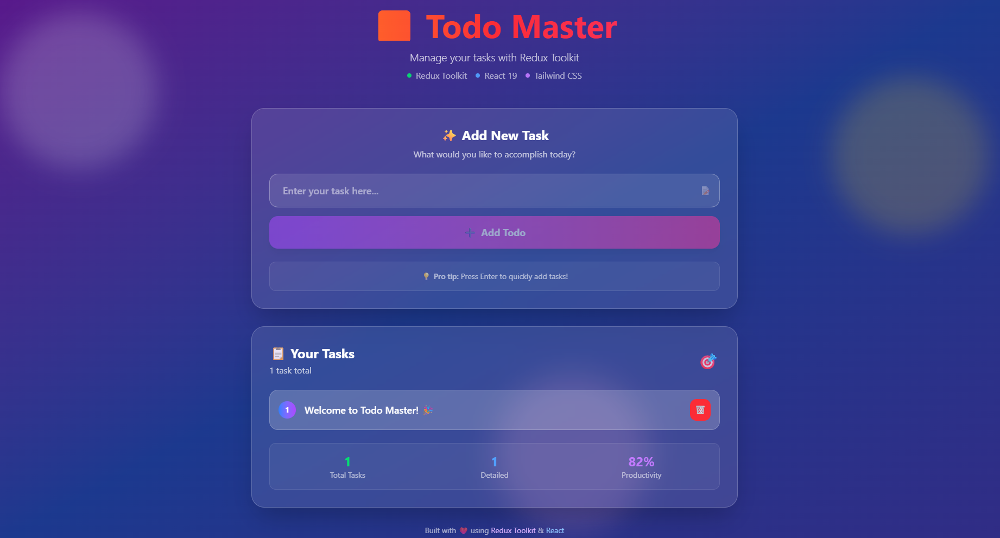

# ✅  Todo App

A modern, feature-rich todo application built with React and Redux Toolkit. Experience seamless state management with a beautiful, responsive interface powered by Tailwind CSS.

*Application Home Page*
<div align="center">


</div>

## ✨ Features

- 📝 **Add Todos** - Create new tasks with ease
- ❌ **Delete Todos** - Remove completed or unwanted tasks
- ✏️ **Edit Todos** - Update existing tasks inline
- 🎨 **Beautiful UI** - Modern design with Tailwind CSS
- ⚡ **Fast Performance** - Powered by Vite and Redux Toolkit
- 📱 **Responsive Design** - Works perfectly on all devices
- 🔄 **Persistent State** - Redux state management for reliable data handling


## 🛠️ Built With

- **React 19** - Modern React with latest features
- **Redux Toolkit** - Efficient Redux logic with less boilerplate
- **React Redux** - Official React bindings for Redux
- **Tailwind CSS** - Utility-first CSS framework
- **Vite** - Next generation frontend tooling
- **nanoid** - Unique ID generator for todos

## 📋 Prerequisites

Before running this project, make sure you have:

- **Node.js** (version 16 or higher)
- **npm** or **yarn** package manager

## 🔧 Installation

1. **Clone the repository**
   ```bash
   git clone https://github.com/yourusername/redux-toolkit-todo.git
   cd redux-toolkit-todo
   ```

2. **Install dependencies**
   ```bash
   npm install
   ```

3. **Start the development server**
   ```bash
   npm run dev
   ```

4. **Open your browser**
   Navigate to `http://localhost:5173` to see the application

## 📁 Project Structure

```
redux-toolkit/
├── public/
│   └── vite.svg
├── src/
│   ├── App.jsx              # Main application component
│   ├── main.jsx            # Application entry point
│   ├── index.css           # Global styles
│   ├── app/
│   │   └── store.js        # Redux store configuration
│   ├── components/
│   │   ├── Forms.jsx       # Todo input form component
│   │   └── Todos.jsx       # Todo list display component
│   └── features/
│       └── todo/
│           └── todoSlice.js # Redux slice for todo logic
├── package.json
├── vite.config.js
└── README.md
```

## 🎯 How It Works

### Redux Store Architecture
- **Store**: Centralized state management with Redux Toolkit
- **Slice**: Todo slice with reducers for add, remove, and update operations
- **Actions**: Auto-generated action creators for state mutations
- **Selectors**: Efficient state selection for components

### Component Flow
1. **Forms Component** - Handles todo input and dispatches addTodo action
2. **Todos Component** - Displays todo list and handles delete/edit operations
3. **Redux Store** - Manages all todo state and operations

## 🎨 Features Breakdown

### ➕ Add Todos
```javascript
// Add new todo with unique ID
addTodo: (state, action) => {
    state.todos.push({
        id: nanoid(),
        text: action.payload
    })
}
```

### 🗑️ Remove Todos
```javascript
// Filter out deleted todo
removetodo: (state, action) => {
    state.todos = state.todos.filter((todo) => todo.id !== action.payload)
}
```

### ✏️ Update Todos
```javascript
// Update existing todo text
updatetodo: (state, action) => {
    state.todos.map((todo) => {
        if(todo.id === action.payload.id) {
            todo.text = action.payload.text
        }
    })
}
```

## 📜 Available Scripts

- `npm run dev` - Start development server with hot reload
- `npm run build` - Build optimized production bundle
- `npm run preview` - Preview production build locally
- `npm run lint` - Run ESLint for code quality checks

## 🎨 Styling

This project uses **Tailwind CSS** for styling with:
- **Responsive Design** - Mobile-first approach
- **Modern Components** - Clean, minimalist interface
- **Color Scheme** - Professional dark/light theme support
- **Animations** - Smooth transitions and hover effects

## 🚀 Deployment

### Build for Production
```bash
npm run build
```

### Deploy to Popular Platforms
- **Vercel**: Connect your GitHub repo for automatic deployments
- **Netlify**: Drag and drop the `dist` folder
- **GitHub Pages**: Use GitHub Actions for automated deployment

## 🔧 Customization

### Adding New Features
- **Todo Categories**: Extend the slice to include categories
- **Due Dates**: Add date fields to todo items
- **Priority Levels**: Implement priority-based sorting
- **Search & Filter**: Add search functionality

### Styling Modifications
- **Theme Colors**: Modify Tailwind color palette
- **Layout**: Adjust component layouts and spacing
- **Typography**: Customize fonts and text styles

## 🐛 Troubleshooting

### Common Issues

1. **Dependencies Error**
   ```bash
   npm install --legacy-peer-deps
   ```

2. **Port Already in Use**
   ```bash
   npm run dev -- --port 3001
   ```

3. **Build Issues**
   ```bash
   npm run build --verbose
   ```

## 🤝 Contributing

1. Fork the project
2. Create your feature branch (`git checkout -b feature/AmazingFeature`)
3. Commit your changes (`git commit -m 'Add some AmazingFeature'`)
4. Push to the branch (`git push origin feature/AmazingFeature`)
5. Open a Pull Request

## 📚 Learning Resources

- [Redux Toolkit Documentation](https://redux-toolkit.js.org/)
- [React Redux Documentation](https://react-redux.js.org/)
- [Tailwind CSS Documentation](https://tailwindcss.com/docs)
- [Vite Documentation](https://vitejs.dev/)

## 📝 License

This project is licensed under the MIT License - see the [LICENSE](LICENSE) file for details.

## 🙏 Acknowledgments

- [Redux Toolkit](https://redux-toolkit.js.org/) for simplified Redux logic
- [Tailwind CSS](https://tailwindcss.com/) for the amazing utility-first CSS
- [Vite](https://vitejs.dev/) for the blazing fast build tool
- [React](https://reactjs.org/) for the powerful UI library

## 📞 Contact

Your Name - [@yourusername](https://twitter.com/yourusername) - your.email@example.com

Project Link: [https://github.com/yourusername/redux-toolkit-todo](https://github.com/yourusername/redux-toolkit-todo)

---

<div align="center">

⭐ **Star this repo if you found it helpful!** ⭐

Made with ❤️ and Redux Toolkit

</div>
